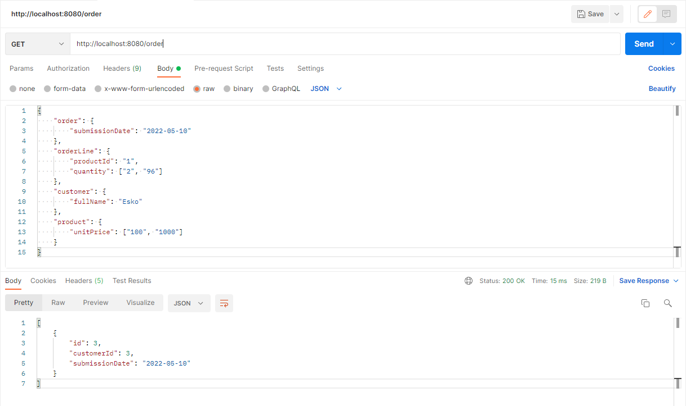

# Kuehne+Nagel Assessment Task - BE

## How-to

1. **copy** this project
2. **change** properties in the src/main/resources/**application.properties**
3. **create** a database
4. **have** **_fun_**

## Project Features

- **SpringBoot** framework to be able to make the program faster and better structured

- **Liquibase** for flexible database data processing

- **MVC** pattern for well-structured code

## Project Structure

### Models

> Database data representatives

- **_Customer_**

  - **id**(PK, AI, NotNull, int)
  - **registrationCode**(Unique, NotNull, varchar(31))
  - **fullName**(varchar(255))
  - **email**(Unique, varchar(255))
  - **telephone**(varchar(31))

- **_Product_**

  - **id**(PK, AI, NotNull, int)
  - **name**(varchar(255))
  - **skuCode**(Unique, NotNull, varchar(31))
  - **unitPrice**(varchar(31))

- **_Order_**

  - **id**(PK, AI, NotNull, int)
  - **customerId**(NotNull, int) -> _Customer(id)_
  - **submissionDate**(NotNull, date)

- **_OrderLine_**
  - **id**(PK, AI, NotNull, int)
  - **productId**(NotNull, int) -> _Product(id)_
  - **quantity**(NotNull, int)
  - **orderId**(NotNull, int) -> _Order(id)_

### Controllers

> REST API requests handlers

- | **/customer** | **_CustomerController_**

  - | **GET \*/** | **getAllCustomers()**
  - | **GET \*/{id}** | **getCustomerById()** - takes **id** as an Integer
  - | **POST \*/** | **createCustomer()** - takes JSON body as a **Customer**

- | **/product** | **_ProductController_**

  - | **GET \*/** | **getAllProducts()**
  - | **GET \*/{id}** | **getProductById()** - takes **id** as an Integer
  - | **POST \*/** | **createProduct()** - takes JSON body as a **Product**

- | **/order** | **OrderController**
  - | **GET \*/** | **getAllOrders()** - takes JSON body (not necessary)
  - | **GET \*/{id}** | **getOrderById()** - takes **id** as an Integer
  - | **GET \*/{id}/line** | **getOrderLinesByOrderId()** - takes **id** as an Integer
  - | **POST \*/** | **createOrder()** - takes JSON body as a **Order**
  - | **GET \*/line** | **getAllOrderLines()**
  - | **GET \*/line/{id}** | **getOrderLineById()** - takes **id** as an Integer
  - | **PUT \*/line/{id}** | **updateOrderLineById()** - takes **id** as an Integer and JSON body
  - | **POST \*/line** | **createOrderLine()** - takes JSON body as a **OrderLine**

### Services

> Model data manipulators

There are too many different functions and I am too lazy to write them all, but will say that they have **self-explanatory names** so you will probably understand what their responsibilities are.

Actualy will say one more thing - In the **OrderController** the **getAllOrders()** method can take JSON body and there is a reason for that - **deep sorting opportunity**. So you can search by **any** parameters of that and **others** Models that are somehow related to Order or OrderLine. e.g. -

### Repositories

> Query-level Model data manipulators

Repositories are the **closest** layer for Models manipulating, which is done through functions that _query_ information directly using SQL Queries.

## UnitTests

> You can find REST API Unit Tests in the src/**test**/java/com.fk.knp/**Controllers**
